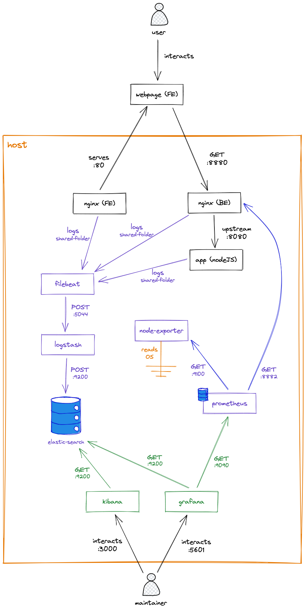
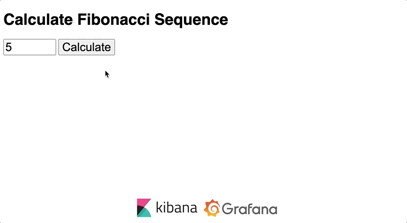
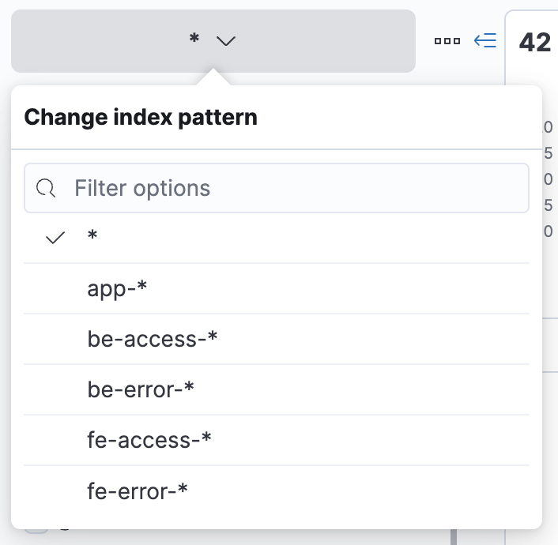
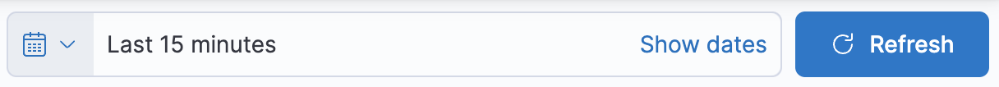
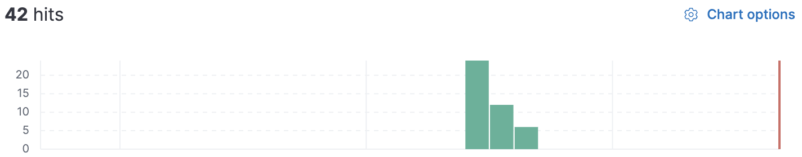
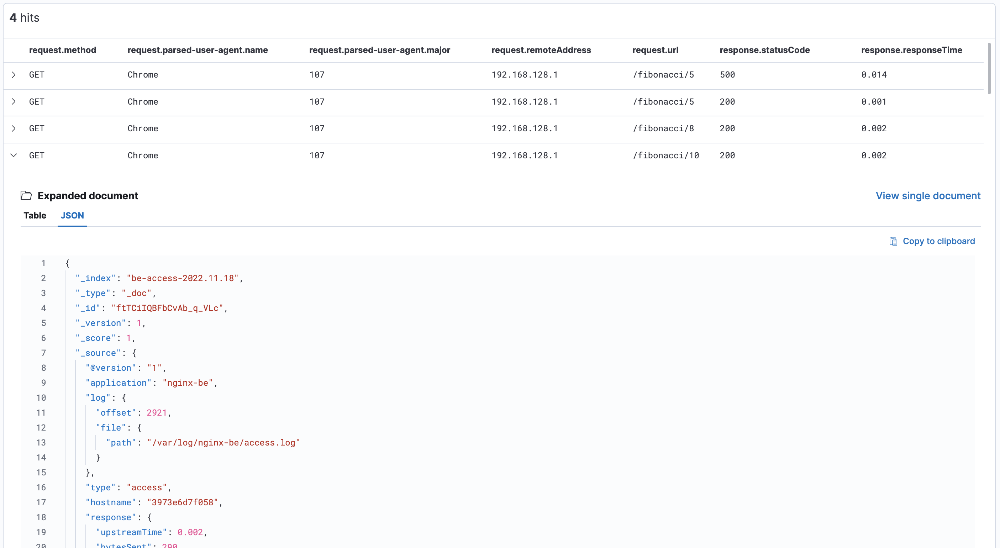
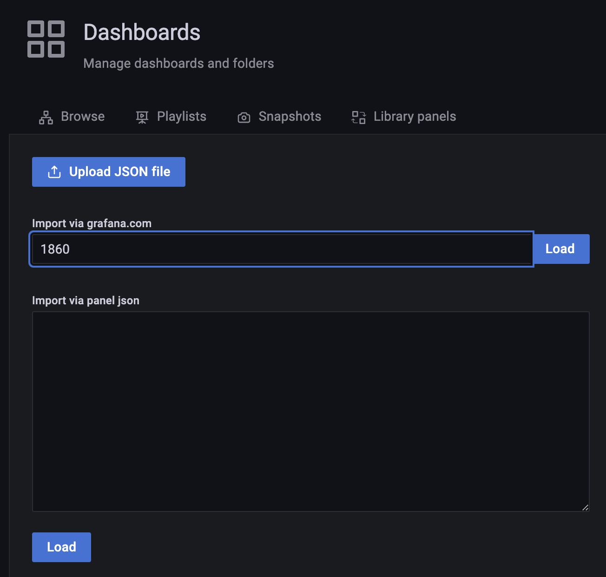
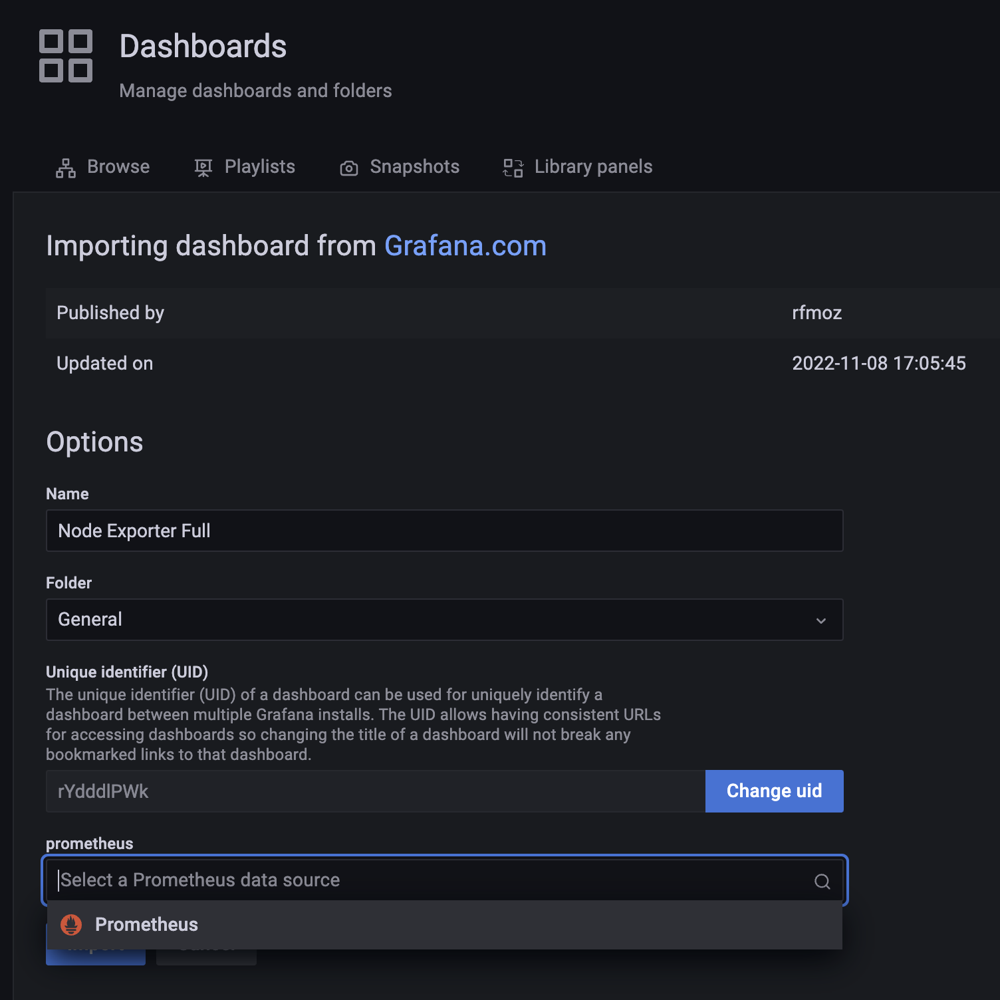
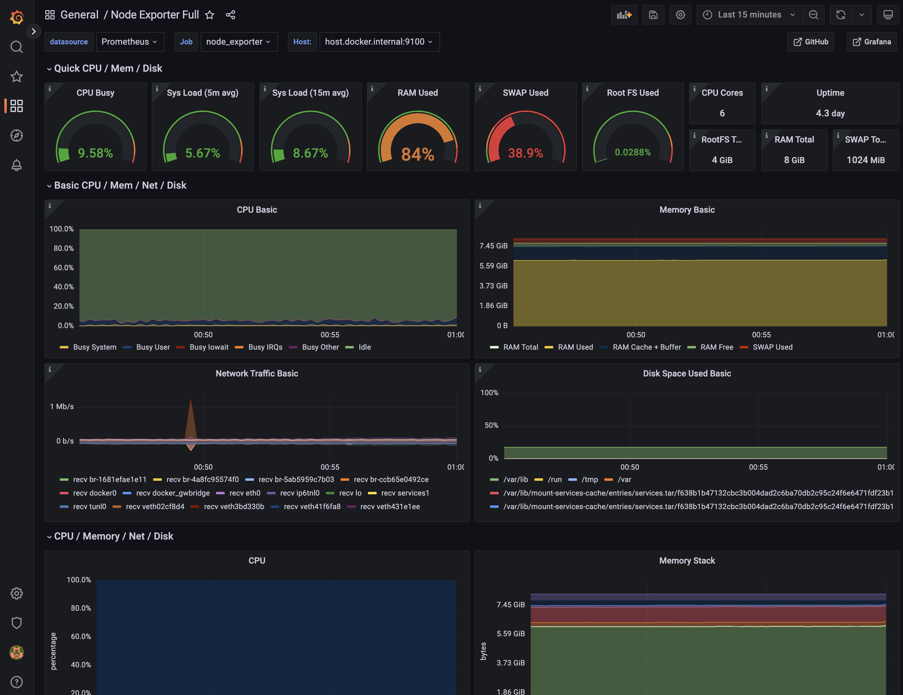

# observability

This project aims to explore some ways to monitor an application with logs and metrics.

The application itself is trivial and just calculates a Fibonacci sequence (purposefully in an inefficient way), but it also generates logs and metrics. It is composed by:

* nginx-fe: an NGInx instance that serves static files (e.g. index.html)
* nginx-be: an NGInx instance with reverse proxy to the backend API. Besides generating logs, it also provides [VTS stats](https://github.com/vozlt/nginx-module-vts).
* app: a NodeJS application that calculates the Fibonacci sequence and generates logs

To collect metrics and logs, the following services were used:

* filebeat: watch log folders/files and sent the new entries to logstash
* logstash: transform the log entries (structure it, convert types and add geo-information based on ip) and store on elastic-search
* elastic-search: stores logs while enables fast and robust searches
* prometheus: scraps for metrics from VTS module and host machine and stores them
* node-exporter: watch host machine and provides metrics to prometheus

Finally, the following services enable users (maintainer) to track and monitor metrics and logs

* kibana: to explore and consolidate log entries
* grafana: to visualize metrics through dashboards

The next image shows the connection between those services



*Disclaimer: the log format of NGInx instances was changed to a very long format. It is not recommended, since it may generate very big files and imply high costs.*

## Running

The whole project was composed in a docker-compose file, so to start it, you can use:

```bash
$ docker compose build
$ docker compose up
```

## Using

To start using the application, open [localhost](http://localhost) on your browser and feel free to ask for some Fibonacci sequences.



## Exploring Logs

You can browse and explore logs through [Kibana](http://localhost:5601) (note the link on the page bottom). Let's start using the module "[Discover](http://localhost:5601/app/discover)" on the left menu.

The init service has already created some index patterns. You can choose to explore a specific index or use `*` to explore all log data.



Select the interval you wat to explore.



The histogram will show you the hit (log entry) count and their distribution on the time.



Finally, you can explore individual logs, expand them, filter by fields, or build a table.



Visit [elastic.co](https://www.elastic.co/) to lean more about Kibana.

## Exploring Metrics

If you want to get an overview of your system instead of get detailed logs, you can check the metrics. In this stack we used [Grafana](http://localhost:3000) to show them.

The default username and password is `admin` and `admin` respectively.

The `init` service has already created the datasources, so you can start exploring. If you are not experient on Grafana, you can get some ready dashboads on Grafana's portal. Here is some interesting ones:

* [Host vitals (node exporter)](https://grafana.com/grafana/dashboards/1860-node-exporter-full/)
* [NGInx VTS statistics](https://grafana.com/grafana/dashboards/14824-nginx-vts-stats/)

Just get their IDs and paste [here](http://localhost:3000/dashboard/import):



Select Prometheus as datasource, and `Import`.



Check out the result :)


